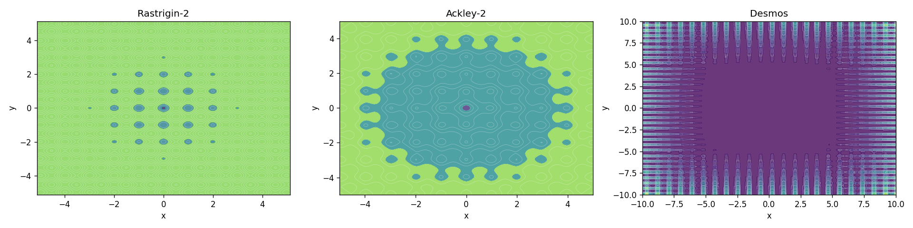
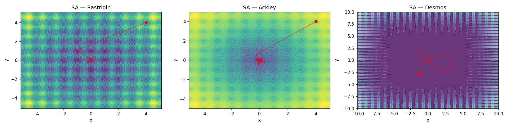
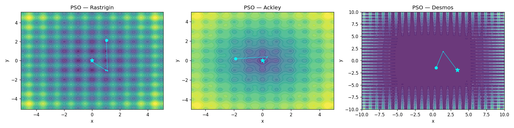
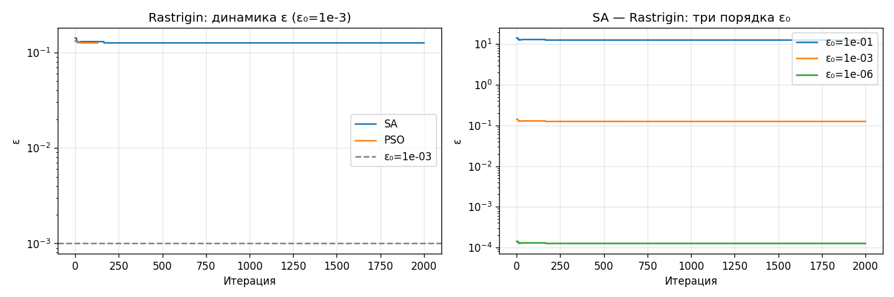

# Лабораторная работа №2

**Стохастические методы оптимизации**  
Продвинутые методы оптимизации — ИТМО, 2026

---

## 1. Тестовые функции

Исследуются три функции с принципиально разными свойствами.

**Растригин-2:**
$$f(x, y) = 20 + x^2 - 10\cos(2\pi x) + y^2 - 10\cos(2\pi y)$$
Глобальный минимум $f^* = 0$ в точке $(0, 0)$. Гладкая, сильно мультимодальная: около 400 локальных минимумов на области $[-5.12, 5.12]^2$, расположенных регулярной сеткой с шагом 1.

**Экли-2:**
$$f(x, y) = -20\exp\!\left(-0.2\sqrt{\tfrac{x^2+y^2}{2}}\right) - \exp\!\left(\tfrac{\cos 2\pi x + \cos 2\pi y}{2}\right) + e + 20$$
Глобальный минимум $f^* = 0$ в точке $(0, 0)$. Во внешней области почти плоская (градиент мал), в центре — узкая глубокая яма. Гладкая.

**Desmos (негладкая):**
$$f(x, y) = \bigl(x\cdot(\mathrm{round}(\sin 10y)+2)\bigr)^2 + y - 10\bigr)^2 + \bigl(x + (y\cdot(\mathrm{round}(\sin 7x)+2))^2 - 7\bigr)^2$$
Разрывна из-за $\mathrm{round}(\cdot)$. Градиент не определён. Приближённый глобальный минимум $f^* \approx 0$ существует, но локализован трудно.

---

## 2. Теория методов

### 2.1 Simulated Annealing (метод имитации отжига)

Аналогия из физики: при медленном охлаждении металла атомы успевают найти состояние с минимальной энергией. В оптимизации «температура» $T$ управляет вероятностью принятия ухудшающего шага.

**Алгоритм:**
1. Случайный сосед: $x' = x + \mathcal{N}(0, \sigma)$
2. Принятие по критерию Метрополиса:
$$P(\text{принять}) = \begin{cases} 1 & \text{если } \Delta E < 0 \\ \exp(-\Delta E / T) & \text{иначе} \end{cases}$$
3. Охлаждение: $T_k = T_0 \cdot \alpha^k$, где $\alpha \in (0, 1)$

При высокой $T$ метод исследует пространство (принимает почти любой шаг). При низкой $T$ переходит в режим локального улучшения. Баланс задаётся скоростью охлаждения $\alpha$.

**Память:** хранятся только $x_\text{cur}$ и $x_\text{best}$ — $O(n)$ = **32 байта** для $n=2$.

### 2.2 Particle Swarm Optimization (метод роя частиц)

Моделирует коллективное поведение стаи птиц: каждая частица движется под влиянием собственного лучшего опыта и лучшей позиции в рое.

**Алгоритм** (gbest-топология):

$$v_i \leftarrow w \cdot v_i + c_1 r_1 (\text{pbest}_i - x_i) + c_2 r_2 (\text{gbest} - x_i)$$
$$x_i \leftarrow x_i + v_i$$

где $w$ — инерционный вес, $c_1$ — когнитивный коэффициент, $c_2$ — социальный.

Используемые параметры: $w=0.7$, $c_1=c_2=1.5$, $N=30$ частиц.

**Память:** позиции + скорости + личные лучшие = $3 \cdot N \cdot n$ — $O(N \cdot n)$ = **1456 байт** при $N=30$, $n=2$.

### 2.3 Реализация поверх конструктивного числа

SA и PSO работают в пространстве вещественных чисел, но передают входы в функцию как конструктивные числа $x_i \pm \varepsilon$. Для совместимости реализованы интервальные версии тригонометрических функций:

$$\sin([m-\varepsilon, m+\varepsilon]) \subseteq [\sin m - \varepsilon,\; \sin m + \varepsilon]$$

поскольку $|d/dx\, \sin x| = |\cos x| \leq 1$. Аналогично для $\cos$. Для $\mathrm{round}()$ — проверка пересечения интервала с полуцелым: если пересекает, возвращается расширенный интервал из двух соседних целых.

---

## 3. Результаты

### 3.1 Сравнительная таблица

Все значения `f_calls` накоплены за 3 прогона замера времени (best-of-3), фактическое число вызовов = `f_calls / 3`.

| Метод / Функция | $f^*$ | Итераций | Вызовов f | Время, мс | Память, Б |
|---|---|---|---|---|---|
| NM / Растригин | 3.18e+01 | 21 | 42¹ | 2.5 | 48 |
| GDA / Растригин | **0.00e+00** | 1 | 4¹ | 0.1 | 32 |
| SA / Растригин | 1.90e-02 | 10 000 | 10 001¹ | 98.7 | 32 |
| PSO / Растригин | **5.65e-07** | 71 | 2 160¹ | 20.4 | 1 456 |
| NM / Экли | 1.10e+01 | 21 | 42¹ | 2.6 | 48 |
| GDA / Экли | 9.73e+00 | 4 999 | ~85 000¹ | 3 481 | 32 |
| SA / Экли | 3.34e-02 | 10 000 | 10 001¹ | 79.4 | 32 |
| PSO / Экли | **9.81e-07** | 114 | 3 450¹ | 11.7 | 1 456 |
| NM / Desmos | 6.19e+01 | 106 | 212¹ | 14.3 | 48 |
| SA / Desmos | **1.83e-02** | 20 000 | 20 001¹ | 200.8 | 32 |
| PSO / Desmos | 4.25e-02 | 1 000 | 50 050¹ | 223.0 | 1 456 |

¹ Фактические вызовы (таблица показывает утроенные значения из-за best-of-3 замера).

### 3.2 Траектории SA

SA плавно смещает лучшее решение к глобальному минимуму. На Растригине и Экли финальная точка находится вблизи $(0,0)$. На Desmos — попадает в область с низким значением функции, несмотря на разрывную структуру.

### 3.3 Траектории PSO

PSO сходится к глобальному минимуму быстро и прямолинейно на гладких функциях (71 и 114 итераций). На Desmos рой не сходится столь же чисто — нарушения гладкости нарушают направленность скоростей.

---

## 4. Анализ конструктивных чисел

**Коэффициент усиления** для Растригина при $x_0 = (4, 4)$:

$$\frac{\varepsilon_\text{out}}{\varepsilon_0} = \frac{0.1417}{10^{-3}} \approx 142$$

Теоретически: каждое слагаемое $x^2 - 10\cos(2\pi x)$ даёт погрешность $\approx (2|x| + 10 \cdot 2\pi)\,\varepsilon_0$. При $x=4$: $(8 + 62.8) \approx 70.8$ на компоненту, итого $2 \times 70.8 \approx 141.6$ — совпадает с наблюдаемым.

**Малое уменьшение ε вдоль траектории** (142 → 126) контрастирует с лабораторной работой №1, где ε падало до нуля. Причина: в минимуме $(0,0)$ квадратичный член $x^2$ обнуляется, но слагаемое $10\cos(2\pi x)$ сохраняет производную $|10 \cdot 2\pi \cdot \sin(2\pi x)| \leq 62.8$, которая не обнуляется. Погрешность ограничена снизу значением $\approx 125.6\,\varepsilon_0$ даже в глобальном минимуме.

Три порядка $\varepsilon_0$ показывают линейное масштабирование: фактор усиления постоянен.

---

## 5. Сравнение с лабораторной работой №1

| | NM | GDA | SA | PSO |
|---|---|---|---|---|
| Тип функций | гладкие унимодальные | гладкие | любые | любые |
| Сходимость | локальная | локальная | глобальная (вероятностная) | глобальная (вероятностная) |
| Требует градиент | нет | да | нет | нет |
| Память | $O(n^2)$ | $O(n)$ | $O(n)$ | $O(N \cdot n)$ |
| Лаб. 1 (квадратичная κ≈1) | ✓ | **лучший** | избыточен | избыточен |
| Лаб. 2 (Растригин/Экли) | ✗ | ✗ | ✓ | **лучший** |
| Лаб. 2 (Desmos, негладкая) | ✗ | н/д | **лучший** | ✓ |

**Почему методы 1-го порядка проигрывают:** GDA на Экли сделал ~85 000 вызовов функции и не сошёлся — внешняя плоскость функции Экли даёт градиент порядка $10^{-3}$, каждый Armijo-шаг требует до 50 делений шага. На мультимодальных функциях GDA гарантированно попадает в ближайший локальный минимум.

**Почему PSO лучше SA на гладких функциях:** рой из 30 частиц покрывает область поиска сразу; социальный член $c_2(\text{gbest} - x_i)$ целенаправленно тянет частицы к лучшей найденной точке. SA исследует последовательно, без «памяти» о глобальном лучшем у популяции.

**Почему SA лучше PSO на Desmos:** разрывы $\mathrm{round}(\cdot)$ создают «стены» нулевого градиента между областями. Скоростная динамика PSO не умеет пересекать разрывы — частицы застревают в одной области. SA случайно прыгает через разрывы с вероятностью $\exp(-\Delta E / T)$.

---

## 6. Выводы

1. **PSO — оптимальный выбор для гладких мультимодальных функций**: 71 итерация против 10 000 у SA, точность $10^{-7}$ против $10^{-2}$.

2. **SA — единственный работающий вариант для негладких функций**: справляется с разрывами там, где PSO и GDA не могут.

3. **NM и GDA не подходят для мультимодальных задач**: всегда сходятся к ближайшему локальному минимуму, независимо от числа итераций.

4. **Компромисс памяти**: SA ($32$ Б) vs PSO ($1\,456$ Б) — PSO в 45 раз «тяжелее» при $N=30$, $n=2$. При высоких размерностях $n$ и больших роях разница критична.

5. **Погрешность ε не убывает к нулю на Растригине**: наличие тригонометрических слагаемых с коэффициентом 10 даёт нижнюю границу усиления $\approx 126\,\varepsilon_0$, которая не зависит от близости к минимуму.

---

## Код

- [`src/cn_math.py`](./src/cn_math.py) — интервальная арифметика для тригонометрии
- [`src/functions.py`](./src/functions.py) — тестовые функции
- [`src/optimizers.py`](./src/optimizers.py) — SA и PSO
- [`src/lab1_optimizers.py`](./src/lab1_optimizers.py) — NM и GDA из лаб. 1
- [`research.ipynb`](./research.ipynb) — эксперименты
